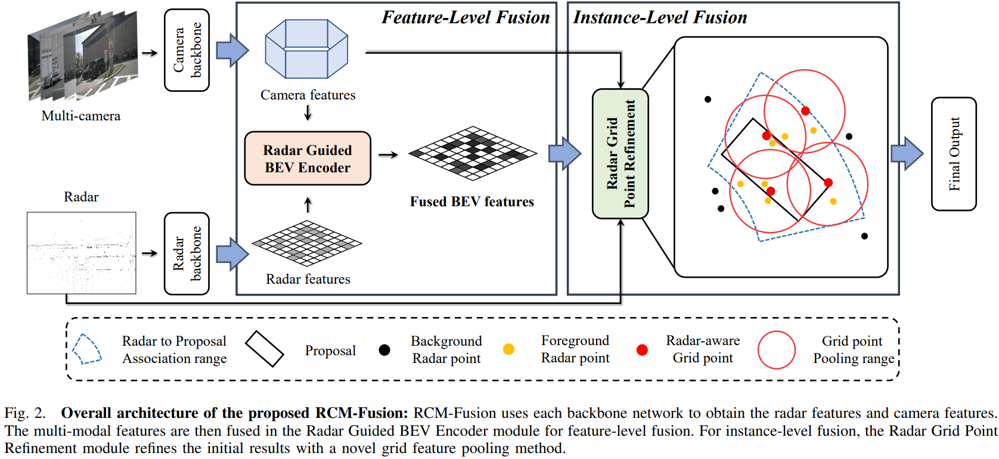
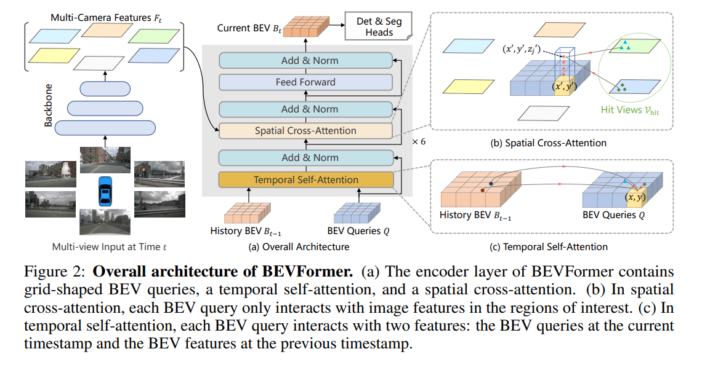

<div align="center">

# RCM-Fusion：Radar-Camera 多级融合 3D 目标检测

**Jittor 混合迁移版本**

[](https://arxiv.org/abs/2307.10249)
[](https://2024.ieee-icra.org/)
[](https://cg.cs.tsinghua.edu.cn/jittor/)

**[中文](README.md) | [English](README_EN.md)**

</div>

---

## 📖 项目简介

本仓库是 **RCM-Fusion**（Radar-Camera Multi-Level Fusion for 3D Object Detection，ICRA 2024）的 **Jittor 混合迁移版本**。

**原始论文**：[RCM-Fusion: Radar-Camera Multi-Level Fusion for 3D Object Detection](https://arxiv.org/abs/2307.10249)  
**原始作者**：Jisong Kim\*, Minjae Seong\*, Geonho Bang, Dongsuk Kum, Jun Won Choi（KAIST）

### 论文摘要

现有雷达-相机融合方法未能充分利用雷达信息的潜力。本文提出 **RCM-Fusion**，在特征级和实例级同时进行多模态融合：

- **特征级融合**：提出雷达引导 BEV 编码器（Radar Guided BEV Encoder），利用雷达 BEV 特征引导相机特征向精确 BEV 表示转换，并融合两者的 BEV 特征
- **实例级融合**：提出雷达网格点精炼模块（Radar Grid Point Refinement），结合雷达点云特性减少定位误差

在公开 nuScenes 数据集上，RCM-Fusion 在单帧雷达-相机融合方法中取得了**最先进（SOTA）性能**。

---

## 🏗 迁移架构概述

### 混合桥接策略："外壳 PyTorch + 内核 Jittor"

本项目采用 **PyTorch-Jittor 混合迁移**策略，而非全量重写。原因在于 RCM-Fusion 依赖的 mmcv / mmdet / mmdet3d / spconv 生态构成了庞大的依赖树，全量迁移成本极高。本方案在保留 PyTorch 生态完整性的前提下，将论文的**核心创新 Transformer 模块**迁移至 Jittor，通过 **DLPack 零拷贝**实现两框架间的高效张量交换。

```
PyTorch 模型（backbone、neck、head）
    │
    ├── CNN Backbone（ResNet-50）      → 保持 PyTorch
    ├── FPN Neck                       → 保持 PyTorch
    ├── Radar Backbone（SECOND）       → 保持 PyTorch
    │
    └── Transformer 核心               → 迁移至 Jittor ★
        ├── BEV Encoder（RadarGuidedBEVEncoder）
        ├── Decoder（DetectionTransformerDecoder）
        └── 所有子模块（Attention、FFN、Gating 等）
```

### DLPack 零拷贝双框架通信

```
PyTorch backbone 输出（GPU Tensor）
    │ torch.utils.dlpack.to_dlpack()
    ↓ 零拷贝，同一块 GPU 显存
Jittor Transformer 输入（GPU Var）
    │ Jittor 前向推理
    ↓
Jittor Transformer 输出（GPU Var）
    │ jt_var.dlpack()
    ↓ 零拷贝，同一块 GPU 显存
PyTorch loss/eval 输入（GPU Tensor）
```

---

## 📊 性能对比

### mAP 恢复率

| 版本 | mAP | NDS | 说明 |
|:---:|:---:|:---:|:---:|
| PyTorch 原版（基准） | 0.3858 | 0.3122 | — |
| Jittor 初版 | 0.1126 | 0.1483 | 权重同步不完整 |
| 第一次优化后 | 0.0324 | 0.1128 | 引入 batch_first 相关 Bug |
| **Jittor 混合版（最终）** | **0.3592** | **0.2945** | **恢复率 93%** ✅ |

### 各类别 AP 对比

| 类别 | PyTorch | Jittor | 恢复率 |
|:---:|:---:|:---:|:---:|
| Car | 0.711 | 0.668 | 94% |
| Truck | 0.580 | 0.521 | 90% |
| Bus | 0.664 | 0.629 | 95% |
| Pedestrian | 0.508 | 0.489 | 96% |
| Motorcycle | 0.453 | 0.435 | 96% |
| Bicycle | 0.286 | 0.274 | 96% |
| Traffic Cone | 0.655 | 0.576 | 88% |
| **Overall** | **0.386** | **0.359** | **93%** |

### 模型 Zoo

| Backbone | 方法 | 训练轮次 | NDS | mAP | 配置文件 | 下载 |
|:---:|:---:|:---:|:---:|:---:|:---:|:---:|
| R50 | RCM-Fusion-R50 | 24ep | 53.5 | 45.2 | [config](projects/configs/rcmfusion_icra/rcm-fusion_r50.py) | [model](https://arxiv.org/abs/2307.10249) |
| R101 | RCM-Fusion-R101 | 24ep | 58.7 | 50.6 | [config](projects/configs/rcmfusion_icra/rcm-fusion_r101.py) | [model](https://arxiv.org/abs/2307.10249) |

---

## 🧩 模型架构



<div align="center">
  
</div>

---

## 🛠 环境配置

### 依赖要求

- Python == 3.10
- CUDA == 11.6
- PyTorch == 1.13.1+cu116
- [Jittor](https://cg.cs.tsinghua.edu.cn/jittor/) == 1.3.8.1
- mmcv-full == 1.7.0
- mmdet == 2.28.2
- mmsegmentation == 0.30.0
- mmdet3d == 1.0.0rc6
- spconv-cu116 == 2.3.6
- nuscenes-devkit == 1.1.11

### 安装步骤

**1. 克隆仓库**

```bash
git clone https://github.com/dcstar221/RCM-Jittor-MixedMigration.git
cd RCM-Jittor-MixedMigration
```

**2. 创建 conda 环境**

```bash
conda create -n rcm_jittor python=3.8 -y
conda activate rcm_jittor
```

**3. 安装 PyTorch（CUDA 11.6）**

```bash
pip install torch==1.13.1+cu116 torchvision==0.14.1+cu116 \
    -f https://download.pytorch.org/whl/torch_stable.html
```

**4. 安装 Jittor**

```bash
pip install jittor
```

**5. 安装 mmcv / mmdet / mmdet3d**

```bash
pip install openmim==0.3.9
mim install mmcv-full==1.7.0
mim install mmdet==2.28.2
mim install mmsegmentation==0.30.0
# mmdet3d 从源码安装（见步骤 7）
```

**6. 安装其余依赖**

```bash
pip install -r requirements.txt
```

**7. 安装 spconv 及其他 3D 工具**

```bash
pip install spconv-cu116==2.3.6 -f https://data.pyg.org/whl/torch-1.13.0+cu116.html
pip install nuscenes-devkit==1.1.11
```

**8. 安装本地 mmdetection3d 扩展（mmdet3d==1.0.0rc6）**

```bash
cd mmdetection3d
pip install -e .
cd ..
```

---

## 📁 数据准备

### 下载 nuScenes 数据集

请前往 [nuScenes 官网](https://www.nuscenes.org/download) 下载 **v1.0-trainval** 完整数据集及 **CAN bus 扩展包**。

**解压 CAN bus 数据**

```bash
unzip can_bus.zip
# 将 can_bus 文件夹移动到 data 目录下
```

**生成 nuScenes 注释文件**

```bash
python tools/create_data.py nuscenes \
    --root-path ./data/nuscenes \
    --out-dir ./data/nuscenes \
    --extra-tag nuscenes \
    --version v1.0 \
    --canbus ./data
```

### 目录结构

```
RCM-Jittor-MixedMigration/
├── projects/
├── tools/
├── mmdetection3d/
├── ckpts/
│   ├── rcm-fusion-r50-icra-final.pth
│   └── rcm-fusion-r101-icra-final.pth
└── data/
    ├── can_bus/
    └── nuscenes/
        ├── maps/
        ├── samples/
        ├── sweeps/
        ├── v1.0-trainval/
        ├── nuscenes_infos_train_rcmfusion.pkl
        └── nuscenes_infos_val_rcmfusion.pkl
```

---

## 🚀 快速开始

### 测试（推理评估）

使用 R50 backbone 进行单 GPU 评估：

```bash
python tools/test.py \
    projects/configs/rcmfusion_icra/rcm-fusion_r50.py \
    ckpts/rcm-fusion-r50-icra-final.pth \
    --eval bbox
```

使用 4 GPU 分布式评估：

```bash
./tools/dist_test.sh \
    projects/configs/rcmfusion_icra/rcm-fusion_r101.py \
    ckpts/rcm-fusion-r101-icra-final.pth \
    4 --eval bbox
```

### 训练

使用 4 GPU 分布式训练：

```bash
./tools/dist_train.sh \
    projects/configs/rcmfusion_icra/rcm-fusion_r101.py \
    4 --work-dir ./workdirs/rcm_fusion_r101
```

---

## 📂 项目结构

```
RCM-Jittor-MixedMigration/
├── projects/mmdet3d_plugin/
│   ├── rcm_fusion/                      # 原始 PyTorch 模块（保留）
│   │   ├── modules/                     # PyTorch Transformer 子模块
│   │   ├── dense_heads/
│   │   │   └── feature_level_fusion.py  # [修改] 注入 Jittor 桥接
│   │   └── jittor_bridge.py             # [新增] 框架桥接层（DLPack）
│   │
│   └── rcm_fusion_jittor/               # [新增] 全部 Jittor 模块
│       ├── builder.py                   # [新增] 模块工厂 + MHA/FFN 实现
│       └── modules/
│           ├── custom_base_transformer_layer.py
│           ├── decoder.py
│           ├── radar_guided_bev_attention.py
│           ├── radar_guided_bev_encoder.py
│           ├── spatial_cross_attention.py
│           └── transformer_radar.py
│
├── tools/
│   ├── train.py                         # [修改] 添加 Jittor 初始化
│   └── test.py                          # [修改] 添加 Jittor 初始化
│
├── docs/
│   ├── install.md
│   ├── prepare_dataset.md
│   └── getting_started.md
│
├── figs/
│   ├── arch.png
│   └── sota_results.png
│
├── RCM_Jittor_Migration_Record.md       # 完整迁移记录文档
└── requirements.txt
```

---

## 🔧 核心技术要点

### PyTorch ↔ Jittor API 映射

| PyTorch / mmcv | Jittor 对应实现 |
|:---|:---|
| `torch.Tensor` | `jt.Var` |
| `torch.zeros` / `torch.ones` | `jt.zeros` / `jt.ones` |
| `torch.cat` | `jt.concat` |
| `torch.stack` | `jt.stack` |
| `nn.MultiheadAttention` | 手动实现 `JittorMultiheadAttention` |
| `build_norm_layer(cfg, dims)` | `nn.LayerNorm(dims)` |
| `build_feedforward_network(cfg)` | `JittorFFN` |
| `build_attention(cfg)` | `build_jittor_module(cfg)` |
| `mmcv.ops.MultiScaleDeformableAttnFunction` | **桥接回 PyTorch CUDA 扩展** |

### 迁移至 Jittor 的模块

| 模块 | 迁移原因 |
|:---|:---|
| `PerceptionTransformerRadar` | 论文多模态融合 Transformer 核心，计算密集型 |
| `RadarGuidedBEVEncoder` | 包含自注意力 + 交叉注意力 + 雷达门控融合 |
| `DetectionTransformerDecoder` | DETR 风格解码器，含多尺度可变形注意力 |
| `MultiheadAttention` | 用 Jittor 原生算子手动重写 |
| `FFN` | 用 Jittor 原生算子手动重写 |
| `RadarCameraGating` | 论文核心创新：雷达-相机门控融合 |

---

## 🐛 踩坑与 Bug 修复记录

本次迁移过程中发现并修复了 5 个关键 Bug，使 mAP 从初版的 0.1126 最终恢复至 0.3592（恢复率 93%）。

| Bug | 现象 | 原因 | mAP 修复幅度 |
|:---|:---|:---|:---:|
| Encoder 文件损坏（重复类定义） | mAP 骤降至 0.0324 | 同一文件中存在两个不完整的 `RadarGuidedBEVEncoderLayer` | +大幅提升 |
| Decoder `batch_first` 错误 | 几乎所有类别 AP 为 0 | `DetrTransformerDecoderLayer` 错误继承 `batch_first=True` | 核心修复 |
| `CustomMSDeformableAttention` 无条件 permute | 维度错乱 | 忘记加 `if not self.batch_first:` 条件判断 | 辅助修复 |
| `RadarCameraGating` 参数命名不匹配 | 8 个 Conv1d 参数无法同步 | Jittor 重写时 state_dict 键名不一致 | 权重同步 |
| `MultiheadAttention` 参数路径不匹配 | 24 个 MHA 参数无法同步 | 缺少 `_AttnParams` 子模块包装 | 权重同步 |

> 📋 详细的完整迁移流程、代码分析和踩坑记录请参见 [RCM_Jittor_Migration_Record.md](RCM_Jittor_Migration_Record.md)。

---

## 📈 SOTA 对比

<div align="center">
  
</div>

---

## 📝 引用

如果本工作对您的研究有所帮助，请考虑引用原始论文：

```bibtex
@article{icra2024RCMFusion,
  title={RCM-Fusion: Radar-Camera Multi-Level Fusion for 3D Object Detection},
  author={Kim, Jisong and Seong, Minjae and Bang, Geonho and Kum, Dongsuk and Choi, Jun Won},
  journal={arXiv preprint arXiv:2307.10249},
  year={2024}
}
```

---

## 🙏 致谢

感谢以下优秀开源项目的贡献：

- [RCM-Fusion（原始 PyTorch 版本）](https://github.com/mjseong0414/RCM-Fusion)
- [BEVFormer](https://github.com/fundamentalvision/BEVFormer)
- [mmdetection3d](https://github.com/open-mmlab/mmdetection3d)
- [detr3d](https://github.com/WangYueFt/detr3d)
- [Jittor](https://github.com/Jittor/jittor)

---

<div align="center">
  <sub>本仓库为 RCM-Fusion 的 Jittor 混合迁移版本，核心 Transformer 模块已迁移至 Jittor 框架运行。</sub>
</div>
